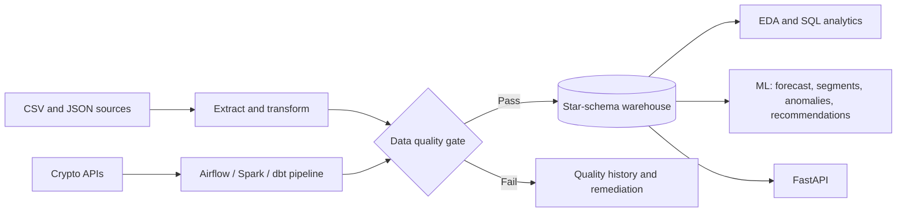

# AI-Ready Data Platform

[](https://github.com/BasmallaMetwally/ai-ready-data-platform/actions/workflows/ci.yml)
[](https://www.python.org/)
[](https://fastapi.tiangolo.com/)
[](#what-this-project-demonstrates)

A production-minded, end-to-end data platform that transforms raw structured
and unstructured data into reliable, ML-ready datasets. It combines automated
ETL, quality gates, warehouse modeling, analytics, machine-learning workflows,
and a unified FastAPI service in one reproducible project.

**Built with:** Python, Pandas, NumPy, SQL, SQLite, PostgreSQL, MySQL,
FastAPI, scikit-learn, Airflow, dbt, Spark, Docker, and GitHub Actions.

النسخة العربية: [`README.ar.md`](README.ar.md). Full change history:
[`CHANGELOG.md`](CHANGELOG.md).

> **Data note:** the e-commerce dataset (`data/raw/*.csv`) is synthetic demo
> data. It is included to make the pipeline reproducible; forecasts, segments,
> and scores are demonstrations rather than business claims.

## Architecture



## What this project demonstrates

- **Reliable ETL:** extract, clean, validate, score, and load data through one
  command: `python3 run_all.py`.
- **Data quality by design:** table-level scoring, threshold-based load
  blocking, remediation, audit trails, and historical quality monitoring.
- **Data engineering foundations:** star-schema warehouse, SQL analysis, and
  migration paths for PostgreSQL and MySQL.
- **AI/ML readiness:** forecasting, segmentation, anomaly detection,
  recommendations, and sentiment analysis for JSON reviews.
- **Operational thinking:** FastAPI endpoints, orchestration artifacts,
  Docker-based crypto stack, and automated CI.

Tested on Ubuntu 24.04, Python 3.12, MySQL 8.0.46, and PostgreSQL 16
(all installed directly via `apt`, not Docker). Docker itself, and live
network access to Binance/CoinGecko/huggingface.co, were not available —
see "Not run end to end" below for exactly what that limited and how it
was worked around.

## Tested and confirmed working

- `dq/` — 34/34 unit tests pass (`python3 -m unittest discover -s dq/tests -v`).
- `etl/pipeline.py` — full run (extract → transform → validate → DQ gate →
  load), including the DQ gate genuinely blocking a load when fed
  deliberately corrupted data (`dq/tests/test_quality_gate.py`).
- All four ML models train and save correctly (`api/train_and_save_models.py`).
- `api/main.py` — every endpoint (`/dq/validate`, `/pipeline/run`,
  `/quality/latest`, `/quality/history/{name}`, `/forecast`,
  `/customers/{id}/segment`, `/sales/anomalies`, `/products/{id}/similar`,
  `/customers/{id}/recommendations`) returns 200 via `TestClient`, and
  `/docs` renders.
- `python3 run_all.py` — the whole pipeline end to end, one command.
- The crypto project's own test suite (mocked HTTP, no live network calls)
  — 67/67 pass, plus 3 new tests for the DQ bridge, plus 1 test confirming
  the bridge degrades cleanly when `dq/` isn't present — 71/71.
- The exact call the Airflow DAG makes
  (`run_ohlcv_quality_gate(rows, symbol=..., threshold=SETTINGS.dq_score_threshold)`)
  was run directly, with the real `pipeline.config.Settings` and the real
  `dq/quality_gate.py`, using the same `PYTHONPATH` layout the Docker
  container has. It scored correctly.
- `notebooks/01_ecommerce_eda.ipynb` — executed end to end against a real
  `database/warehouse.db`, with outputs (tables and plots) saved in the
  file.
- `mysql_migration/` — the full migration (schema + 86,052-row
  `fact_sales` + everything else) run against a real local MySQL 8.0.46
  server, and all four queries in `analytical_queries.sql` run and
  returned real results. See `mysql_migration/README.md` for a genuine
  MySQL-vs-Postgres comparison (both engines were actually installed and
  queried side by side — this also surfaced and fixed a real bug in the
  previously-never-run `postgres_migration/migrate_sqlite_to_postgres.py`).
- `etl/process_reviews.py --backend hf` — the graceful fallback to the
  lexicon backend when the Hugging Face model/framework isn't available
  was directly verified (see "Not run end to end").

## Not run end to end

The full crypto stack (Airflow scheduler, Spark, Postgres, MinIO via
`docker-compose`) requires Docker and live network access to Binance/
CoinGecko — neither was available here. That means: the Airflow DAG has
**not** been run through `airflow db migrate` + DagBag import + scheduler;
`make up` / `make trigger` have not been run. Run those yourself —
`ingestion/crypto/README.md` has the exact commands and two known risks
to watch for (SQLite write contention, and a possible file-permission
mismatch on the `dq/` bind mount) before trusting it in production. The
root `.github/workflows/ci.yml` (see "CI" below) runs the Docker-service
-backed parts of this on every push once it's on GitHub.

The Hugging Face sentiment backend (`etl/process_reviews.py --backend
hf`) was not run against the real model: `transformers` installs fine
from PyPI, but `torch` (multi-GB) was not installed, and huggingface.co
was not reachable to download model weights either way. What *was*
verified is that the fallback path — missing framework/model → log a
warning → use the lexicon backend instead of crashing → and honestly
report which backend actually ran, not the one requested (a bug in an
earlier version, fixed — see `CHANGELOG.md`) — actually triggers and
completes correctly. Run `pip install -r etl/requirements-nlp.txt` and
`python3 etl/process_reviews.py --compare` yourself with real network
access to see actual HF-vs-lexicon accuracy numbers.

## CI

`.github/workflows/ci.yml` at the repo root is what actually runs on
GitHub for this monorepo (a nested `full_stack_optional/.github/workflows/ci.yml`
also exists — kept unmodified for if that folder is ever split back into
its own repo — but GitHub only auto-discovers workflows under the repo
root, so that nested one does not run here on its own). The root
workflow's jobs run each crypto CI step with
`working-directory: ingestion/crypto/full_stack_optional` and
`PYTHONPATH=src:../../../dq` so the DQ-bridge import resolves.

Every non-Docker step was verified from a **clean `python3 -m venv`**
(not the already-populated environment everything else in this repo's
history used), exactly as the workflow runs it. Three real issues were
only caught this way, each root-caused and fixed rather than worked
around: `ruff check`/`ruff format --check` failures in the DQ-bridge
files (fixed with `ruff check --fix` + `ruff format`, tests re-verified
71/71 after); `TestClient` raising `RuntimeError: ... requires the
httpx2 package` in a truly clean install (Starlette's `TestClient`
needs `httpx2` now — added to `requirements.txt`); and, after installing
`pyspark`/`moto[server]` and a real local Postgres `test_market` database
matching the CI service, the exact coverage command
(`--cov=pipeline --cov-fail-under=85`) initially failed at ~82% because
`pipeline/quality/dq_bridge.py` showed 0% coverage from a test importing
it non-canonically — fixed by importing it the way every other test in
the suite does. With all three fixes in place, the CI `test` job's exact
commands now pass for real: **107 tests, 89% coverage**, exit code 0.
Full details in `CHANGELOG.md` (Rounds 3.2–3.3).

The `dbt` job and the full Airflow scheduler/DagBag check as GitHub
Actions itself would run them still need Docker or GitHub's own runners
to verify — not available here. Pushing this to GitHub and watching
Actions run is the next real check beyond what was reproducible locally.

## Platform capabilities

1. **A real DQ gate inside the ETL** (`dq/quality_gate.py` +
   `etl/pipeline.py`). The DQ engine used to be a separate tool. Now every
   table loaded into the warehouse (`dim_customer`, `dim_product`,
   `fact_sales`) is scored automatically before load, and the load is
   blocked below a threshold (80 by default).

2. **One unified API** (`api/main.py`): DQ upload/remediation, e-commerce
   analytics, plus new `POST /pipeline/run` (trigger the ETL over HTTP)
   and `GET /quality/latest` / `GET /quality/history/{dataset_name}`
   (DQ score trend per table over time — the original DQ system only
   tracked history for one uploaded file at a time).

3. **A real bridge between crypto ingestion and the DQ engine**
   (`pipeline/quality/dq_bridge.py`), called from the actual DAG, not just
   a test. Crypto OHLCV batches get scored by the same engine and land in
   the same `dq/quality_history.db` the e-commerce ETL writes to.

4. **One command runs the whole platform**: `python3 run_all.py`.

5. **Real bugs found and fixed** while running this code (see
   `CHANGELOG.md` for the full list) — a model that silently never got
   retrained, a JSON-serialization crash, a deprecated datetime call, a
   wrong keyword argument, and (round 3) a boolean-casting bug in the
   Postgres migration that had never been run before.

6. **An EDA notebook, a MySQL migration path, and an optional Hugging
   Face sentiment backend** (round 3 additions — see `CHANGELOG.md`),
   each verified as described in "Tested and confirmed working" above.

## How to run it

```bash
pip install -r requirements.txt --break-system-packages   # or inside a virtualenv

python3 run_all.py               # DQ check + ETL with the gate + train all models
python3 run_all.py --serve       # same, then serve the API on :8000

# or run each piece by hand:
cd dq && python3 main.py --file customers_orders.csv --name customers_orders --remediate
cd etl && python3 pipeline.py
cd api && python3 train_and_save_models.py && uvicorn main:app --reload --port 8000
```

`http://localhost:8000/docs` has interactive Swagger docs for every
endpoint once the API is running. Open `notebooks/01_ecommerce_eda.ipynb`
in Jupyter (after `run_all.py` has produced `database/warehouse.db`) for
the EDA; see `mysql_migration/README.md` for the MySQL path.

### Tests

```bash
cd dq && python3 -m unittest discover -s tests -v                       # 34/34
cd ingestion/crypto/full_stack_optional
pip install -r requirements-dev.txt                                     # pulls pytest, responses, psycopg[binary], etc.
python3 -m pytest tests/test_dq_bridge.py -v                            # 4/4
python3 -m pytest tests/ -q --ignore=tests/test_spark_silver.py \
    --ignore=tests/test_warehouse_integration.py --ignore=tests/test_lake.py   # 71/71
```

(`requirements.txt` alone is enough to run the platform; the three
ignored test files need real Spark/Postgres/S3 and are covered by the
project's own CI, restored at `ingestion/crypto/full_stack_optional/.github/workflows/ci.yml`.)

## Project layout

```
unified_data_platform/
├── run_all.py                  # single entry point
├── requirements.txt
├── CHANGELOG.md
├── .gitignore                  # generated db/joblib/caches are ignored, not committed
│
├── dq/                         # Data Quality system (project 1), largely as-is
│   ├── main.py, validation.py, scoring.py, auto_remediation.py, ...
│   └── quality_gate.py         # new: the bridge any pipeline can call
│
├── etl/                        # e-commerce ETL (project 2)
│   ├── pipeline.py              # modified: DQ gate step before Load
│   ├── process_reviews.py       # lexicon sentiment (default) + optional HF backend (--backend hf)
│   └── requirements-nlp.txt     # optional, only for --backend hf
│
├── ml/                         # segmentation, forecasting, anomaly, recommendations
├── models/                     # trained models (.joblib) + lookup tables — gitignored
├── database/                   # SQLite warehouse (star schema) — gitignored
├── data/raw/                   # synthetic raw data
│
├── notebooks/
│   └── 01_ecommerce_eda.ipynb   # EDA on the warehouse; ties findings back to the DQ schema
│
├── api/
│   └── main.py                 # unified API (DQ + analytics + pipeline + quality history)
│
├── orchestration/               # airflow_dag.py + simple_scheduler.py, as-is
├── postgres_migration/          # SQLite -> Postgres migration (bug found & fixed in round 3)
├── mysql_migration/              # SQLite -> MySQL migration + real MySQL-vs-Postgres comparison
│
└── ingestion/crypto/            # project 3
    ├── README.md                 # integration details, what's verified, what needs Docker
    └── full_stack_optional/      # the whole original project (Airflow/dbt/Spark/
                                   # docker-compose/CI), with the DQ bridge wired into
                                   # the real DAG
```

## Known gaps

Not addressed in this pass: MySQL as a live *target for the ETL loader*
itself (the migration path exists and is verified in `mysql_migration/`,
but `etl/load.py` still only writes to SQLite — no `--target
sqlite|postgres|mysql` flag yet), a NoSQL store, and real cloud
infrastructure (AWS/GCS/etc — the crypto project's MinIO stands in for
S3 locally). The Hugging Face sentiment backend's actual accuracy is
unverified (see "Not run end to end" above) even though the code and its
fallback path are. Reasonable next additions, not done here for lack of
time/environment access rather than by design.
