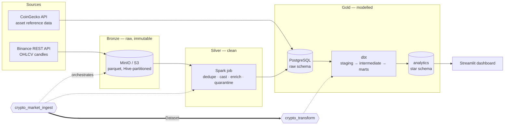
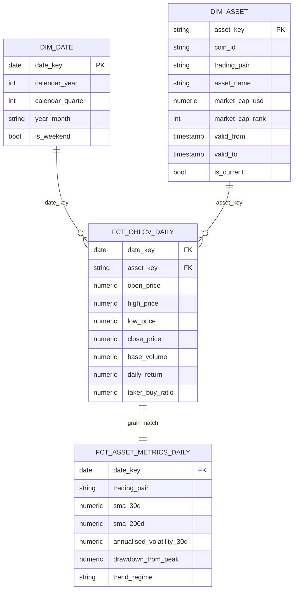
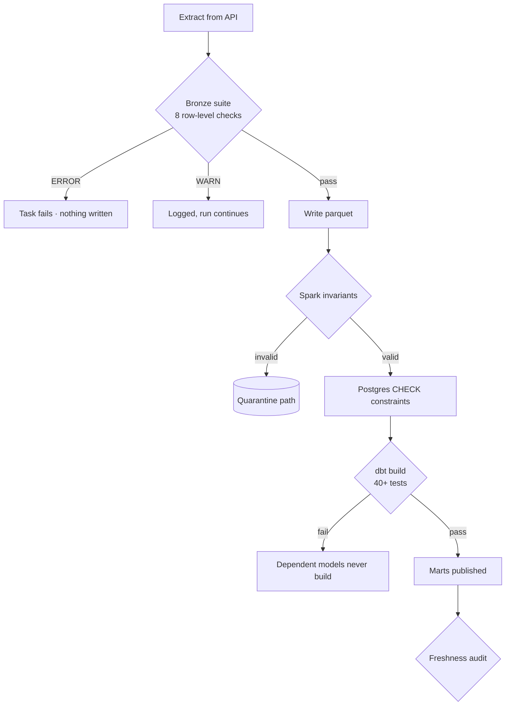

# Crypto Market Data Pipeline

An end-to-end ELT platform that ingests cryptocurrency OHLCV data from Binance, lands it in an S3-compatible data lake, transforms it with Spark, models it into a tested star schema with dbt on PostgreSQL, and serves it through a dashboard — all orchestrated by Airflow and reproducible with a single `make up`.


---

## Architecture



Ingestion and transformation are **separate DAGs joined by an Airflow Dataset**,
not by a schedule offset. `crypto_transform` starts the moment new warehouse
data is published — whether that is the 01:00 run, a manual trigger, or the tail
of a six-year backfill.

### Why each layer exists

| Layer | Technology | What it buys you |
|---|---|---|
| **Bronze** | MinIO + parquet | Immutable raw history. When a business rule changes, replay from here instead of re-hitting the API for years of data. |
| **Silver** | Spark | Deduplication and enrichment that scales identically from 6 rows/day to a 50M-row backfill. |
| **Gold** | PostgreSQL + dbt | A versioned, tested, documented star schema — the contract analysts depend on. |
| **Orchestration** | Airflow | Dependencies, retries, backfills, and a quality gate that blocks bad data before it lands. |

---

## Data model

A textbook Kimball star schema, with `dim_asset` as a **type-2 slowly changing dimension**.



**Why SCD2 on the asset dimension?** Market-cap rank changes constantly. Overwriting it would mean a report rebuilt next year silently restates last year's "top 3 by rank". Facts join to the dimension row that was valid *at the time of the trade*, so history stays correct.

---

## Quickstart

Requirements: Docker Desktop (8 GB RAM allocated) and `make`.

```bash
git clone <your-repo-url> && cd crypto-market-pipeline
cp .env.example .env
make up          # builds images and starts 8 services
```

| Service | URL | Credentials |
|---|---|---|
| Airflow | http://localhost:8080 | `admin` / `admin` |
| Dashboard | http://localhost:8501 | — |
| MinIO console | http://localhost:9001 | `minioadmin` / `minioadmin` |
| Spark master | http://localhost:8081 | — |

Then run the pipeline:

```bash
make trigger                                   # ingest; transform follows via Dataset
make backfill FROM=2024-01-01 TO=2026-09-01    # parallel historical load
make dbt-test                                  # run the full test suite
make health                                    # pipeline SLIs from the warehouse
make lineage MODEL=fct_ohlcv_daily             # blast radius of a change
make psql                                      # query the warehouse
```

> **Binance geo-restrictions.** `api.binance.com` returns HTTP 451 in some countries. If that happens, set `BINANCE_BASE_URL=https://data-api.binance.vision` in `.env` — it serves the same market-data endpoints without restriction.

---

## Data quality

Quality is enforced at four independent layers, so a defect has to defeat all of them to reach a dashboard.



1. **Bronze suite** (`src/pipeline/quality/checks.py`) — row-level predicates with `ERROR`/`WARN` severities. Predicates that raise are treated as failures, so the suite fails *closed*.
   Alongside them, **statistical anomaly detection** compares each run to its own trailing baseline from the audit table. Deterministic rules catch corrupt rows; they are blind to the far more common failure where every row is individually valid and the dataset as a whole is wrong — an upstream quietly returning half its usual volume.
2. **Spark quarantine** — rows failing OHLC invariants are written to a separate path rather than dropped silently. Bad data stays inspectable.
3. **Database constraints** — `CHECK (high >= low AND high >= close)` and friends. A constraint cannot be bypassed by a rogue backfill script.
4. **dbt tests** — schema tests plus three singular tests: no missing trading days, no impossible price jumps, exactly one current version per asset. Run with `--store-failures`, so an investigation starts with a `SELECT` rather than guesswork.
5. **Enforced data contracts** — `fct_ohlcv_daily` declares all 23 columns with types and constraints. Renaming or retyping a column fails the build instead of a downstream consumer.

---

## Engineering decisions worth discussing

**Idempotency everywhere.** Every task converges to the same state on re-run: parquet writes overwrite by partition, Postgres loads are `COPY` + `ON CONFLICT DO UPDATE`, and `fct_ohlcv_daily` uses `delete+insert` over a rolling window. This is what makes `catchup=True` and casual retries safe.

**Deliberate overlap on extraction.** Each run re-reads `LOOKBACK_DAYS` of history. Exchanges revise candles after the fact; because the load is idempotent, the overlap costs nothing and catches corrections a naive "yesterday only" extractor would miss forever.

**Dynamic task mapping.** `extract_to_lake.expand(symbol=symbols)` generates one task per trading pair at runtime. Adding an asset is an Airflow Variable change, not a code deploy.

**`fct_asset_metrics_daily` is intentionally a full rebuild.** Its windows look back 200 days. An incremental build would compute wrong values at every slice boundary — a bug that produces plausible-looking numbers and is therefore very hard to catch.

**Decimal, never float, for money.** `NUMERIC(38,12)` throughout. Floats accumulate rounding drift across aggregations, and financial data is the one place that is unforgivable.

**365-day annualisation.** Crypto never closes. Using the equity convention of 252 trading days understates annualised volatility by roughly 20%.

**A COPY loader instead of Spark JDBC.** At this volume a `COPY` into a temp table beats JDBC on speed and keeps proper transactional upsert semantics. Spark is used where it actually earns its keep: the transformation.

**An unknown member in `dim_asset`.** When a fact arrives for an asset the dimension has never seen, it resolves to `asset_key = '-1'` rather than to a fabricated key. Without it you either carry an orphan key that breaks referential integrity, or drop the row and watch your measures silently stop adding up.

**Rate limiting before the request, not after the 429.** A token bucket paces every call; a circuit breaker fails fast when an upstream is hard down, instead of burning the Airflow pool on exponential backoff.

**Observability that cannot break what it observes.** Every audit write and alert send is failure-tolerant — an audit insert that throws would turn a successful load into a failed task, which is strictly worse than losing one metric row.

---

## Repository layout

```
├── airflow/dags/            4 DAGs: ingest, transform (Dataset-triggered),
│                            weekly dimension, parallel backfill
├── src/pipeline/
│   ├── config.py            typed settings, single source of truth
│   ├── http.py              token bucket + circuit breaker, shared by clients
│   ├── observability.py     audit trail, run metrics, failure alerting
│   ├── extract/             Binance + CoinGecko clients (retry, pagination)
│   ├── load/                parquet lake writer, Postgres COPY loader
│   ├── transform/           PySpark bronze → silver job
│   └── quality/             declarative data-quality framework
├── dbt/
│   ├── models/staging/      views: rename, cast, clean. No business logic.
│   ├── models/intermediate/ ephemeral window-function layer
│   ├── models/marts/        dim_date, dim_asset, 2 facts, 2 marts, contracts
│   ├── snapshots/           reference-data audit trail
│   └── tests/               3 singular tests for cross-model invariants
├── sql/ddl/                 schemas, tables, CHECK constraints, grants
├── dashboard/               Streamlit app (thin: plain SELECTs on marts)
├── tests/                   103 unit + integration tests (see below)
├── .github/workflows/ci.yml lint · types · tests · dbt compile · DAG import
└── docker-compose.yml       8 services, healthchecked, one command
```

---

## Testing

```bash
make test     # 103 tests: fast mocked unit tests plus real-system integration tests
make lint     # ruff + mypy
make dbt-test # 50 dbt assertions against the live warehouse
```

Tests are layered by what they need:
- **Unit tests** (`test_binance.py`, `test_coingecko.py`, `test_quality_checks.py`, `test_anomaly_detection.py`, `test_http.py`, `test_observability.py`, `test_logging_conf.py`, `test_warehouse.py`) — pure Python, fully mocked, run in under a second with no external dependency.
- **Integration tests**, marked `@pytest.mark.integration` and skipped automatically when their dependency is unreachable:
  - `test_lake.py` runs against a real S3-compatible server (`moto`'s standalone mode — `pyarrow.fs.S3FileSystem` is a native, non-boto3 client, so the usual `moto.mock_aws` decorator can't intercept it; a real local HTTP server is the only thing that actually exercises this code path).
  - `test_warehouse_integration.py` runs against a real PostgreSQL server, verifying the `COPY`/`ON CONFLICT` upsert logic and the DDL's `CHECK` constraints for real.
  - `test_spark_silver.py` runs the transformation logic in a real local PySpark session.

Run just the fast unit suite with `pytest tests/ -m "not integration"`.

`make hooks` installs pre-commit hooks so lint and format problems are caught before they reach CI.

CI runs four independent jobs on every push: lint/type-check, unit tests with a 70% coverage floor, dbt compile against a real Postgres service container, and an Airflow `DagBag` import check that catches broken DAGs before they reach a scheduler.

---

## Possible extensions

- Swap MinIO for real S3 and Postgres for Snowflake/BigQuery — only `config.py` and the dbt profile change.
- Add a Kafka + Spark Structured Streaming path for minute-level bars alongside the batch layer.
- Replace the custom bronze suite with Great Expectations if you need a data-docs UI.
- Ship `mart_pipeline_health` to Grafana rather than the Streamlit tab.
- Move secrets from `.env` to an Airflow secrets backend.

## License

MIT

---

## Development history

See [`CHANGELOG.md`](CHANGELOG.md) for the full history across two hardening
rounds:

- **v2** fixed 5 bugs found by re-reading the v1 code (a gap in the SCD2
  timeline, an unsafe incremental key, orphaned foreign keys, a
  cross-partition window function bug in the Spark job, and a dead exception
  branch).
- **v2.1** went further: ran the actual CI commands instead of trusting them,
  which found a 26-point coverage gap, 8 real mypy errors, and 15 unformatted
  files — then, while writing the tests needed to close the coverage gap
  against *real* systems (a local Postgres, a local Spark session, a real
  S3-compatible server) rather than more mocks, found further bugs no amount
  of re-reading would have caught: a `pyarrow` S3 client that silently never
  created its bucket, a schema constraint that wasn't enforced where it
  looked like it was, an unguarded dict lookup in the CoinGecko client, a DAG
  that Airflow could not import at all, a hardcoded database name that broke
  any database not named exactly "market", non-compliant Dataset URIs, and
  two CI verification steps that could never have passed regardless of what
  the project actually contained.

The throughline across both rounds: the hard logic (SCD2 modelling,
concurrency, statistical checks) kept being right on the first pass. Every
failure was in a place you cannot verify by reading — a library's actual
runtime behavior, a framework's validation rules, or a CI script's own
untested assumptions.

For the reasoning behind each design decision, see
[`docs/interview_prep.md`](docs/interview_prep.md).

## Verification scope

Worth being precise about what "verified" means here, since the claim is only
useful if its edges are honest.

**Actually run, with output checked, not just read:**
- The full pytest suite (103 tests) against a real local PostgreSQL 16
  server, a real local PySpark session, and a real S3-compatible server
  (moto's standalone mode) — coverage confirmed at 89.16%.
- `dbt build` against that same real Postgres, seeded with representative
  data — 61/61 tests passing, zero warnings.
- `airflow db migrate` plus a real `DagBag` import of all 4 DAGs, including
  an assertion that the Dataset a consumer DAG listens on is the same URI a
  producer DAG's task actually publishes to.
- Every command copied verbatim from `ci.yml`, not a paraphrase of it — this
  is what caught the two CI steps that could not have passed on their own.

**Not run, and still resting on the design being sound rather than proven:**
- `docker-compose up` end to end. Each service's logic was tested against a
  real instance individually (Postgres, Spark, an S3-compatible store), but
  the 8 containers have never been brought up together through Compose in
  this sandbox, which has no Docker daemon available. The networking,
  environment variable wiring, and startup-order dependencies in
  `docker-compose.yml` are code-reviewed, not execution-tested.
- Binance and CoinGecko's real APIs. `test_binance.py` and `test_coingecko.py`
  mock the HTTP layer; nothing in this project has made a live network call
  to either exchange.
- The Streamlit dashboard rendering against a live warehouse in a browser.
- A real multi-year backfill at the volume that justifies using Spark at all.

If you present this project, the honest version of the pitch is "the
architecture is verified in isolation, layer by layer, against real
databases and a real orchestrator" — not "the whole stack has been run
end-to-end." The second claim would need a machine with Docker to actually
back it up. Before an interview, running `make up` once on your own machine
is what would let you say the fuller version truthfully.
